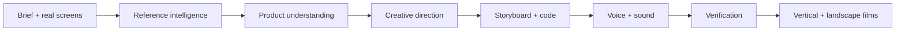

# LaunchLayer

**Building is solved. Distribution isn't.**

LaunchLayer is an agentic launch-film studio for AI products. A founder supplies a product brief, real screens, brand assets, and a motion reference; LaunchLayer watches the reference for creative grammar, studies the product, directs an original campaign, writes the Remotion production, builds synchronized narration and sound, and renders native launch formats.

Built for the **ChatGPT Codex Hackathon 2026** under **UX for Agentic Applications**, with multimodal intelligence as a supporting capability.

## Links

- Live app: [launchlayer-eight.vercel.app](https://launchlayer-eight.vercel.app)
- Public judge demo: [launchlayer-eight.vercel.app/demo](https://launchlayer-eight.vercel.app/demo)
- Repository: [github.com/aariz51/Promo-video](https://github.com/aariz51/Promo-video)

The judge demo requires no account. It plays the real completed SafeMama vertical and landscape films and exposes the same nine-stage trace shown during production.

## The Problem

AI tools have compressed product development from months to days. Distribution has not caught up. A launch film still requires reference research, product understanding, creative direction, storyboarding, motion design, voice, sound, rendering, and format adaptation across disconnected tools and specialists.

LaunchLayer turns that fragmented production process into one observable agent loop. The user stays in control through explicit inputs, stage-level progress, bounded retries, and inspectable results.

## Agentic Workflow

1. **Preflight** secures an isolated Vercel Sandbox and verifies the production toolchain.
2. **Gather inputs** validates product truth, assets, output formats, and the style-only policy.
3. **Watch reference** samples 36 chronological frames and infers pacing, type, composition, and transitions.
4. **Study the app** inspects the logo and real screens to find a credible product story.
5. **Creative direction** maps the reference grammar to the product's own brand and claims.
6. **Storyboard and plan** defines scenes, narration, sound cues, and production structure.
7. **Customize Remotion** writes an original campaign inside the supplied nine-scene motion system.
8. **Build audio** generates one clear narrator, schedules measured takes without overlap, and frame-locks sound.
9. **Verify and render** type-checks the production, validates media contracts, and renders selected formats.



## Why It Is Different

- **Visible agency:** each stage reports what is running, complete, or recoverable instead of hiding behind one loading spinner.
- **Multimodal grounding:** video frames, screenshots, logo, product copy, and audio constraints enter one production plan.
- **Originality boundary:** the reference contributes motion principles only. Reference footage, logos, copy, music, and characters never enter the output.
- **Production code, not a mock video:** the agent writes allowlisted TypeScript/Python files, then Remotion and FFmpeg build the films.
- **Protected narration:** natural TTS takes are measured first, then scheduled sequentially with a mandatory gap. Camel-cased names such as `SafeMama` are spoken clearly as “Safe Mama” without changing the visible wordmark.
- **Cost-aware recovery:** paid steps have bounded retries and checkpoints; delivery retries do not repeat completed creative calls.

## Output Formats

- `1080 x 1920` vertical
- `1920 x 1080` landscape
- `886 x 1920` App Store portrait
- `1920 x 886` App Store landscape

Only requested final MP4 deliverables are persisted. Intermediate frames, source code, voice cache, and production archives remain inside the temporary Sandbox and are deleted with it.

## Stack

Shared by both modes:

- Next.js 15, React 19, TypeScript, Tailwind CSS 4
- Remotion for frame-locked motion and native aspect-ratio rendering
- FFmpeg for frame sampling, sound mixing, App Store cuts and delivery encodes
- One set of creative prompts (`src/lib/pipeline/prompts.ts`) and one
  generated-code contract (`src/lib/pipeline/template-contract.ts`)
- A [motion-graphics library](docs/MOTION_GRAPHICS.md) of reusable techniques,
  adapted from [Creatorberry/flick](https://github.com/Creatorberry/flick) (MIT),
  that the AI selects from per scene

| | Open source (local) | Hosted (SaaS) |
| --- | --- | --- |
| Model runtime | your Claude Code / Codex CLI | OpenRouter |
| Voiceover | offline system speech, or none | OpenRouter `gpt-audio` |
| Execution | a directory + local processes | Vercel Sandbox |
| Orchestration | in-process run | Vercel Workflow DevKit |
| Accounts | none, single user | Supabase Auth |
| Storage | `./.launchlayer` | Supabase Postgres + private Storage |

## Run It Yourself (open source, no API keys)

LaunchLayer runs in two modes. The open-source mode is the default: it runs
entirely on your machine and performs every model call through **your own
Claude Code or Codex CLI login**. It never needs this project's OpenRouter key,
and never needs an OpenAI or Anthropic API key of your own.

### 1. Install the prerequisites

| Requirement | Why | Install |
| --- | --- | --- |
| Node.js 20.19+ | runs the app and the Remotion renderer | `brew install node` |
| FFmpeg (with ffprobe) | frame sampling, audio mixing, delivery encode | `brew install ffmpeg` |
| Python 3 | builds the film's audio master | preinstalled on macOS |
| **Claude Code** *or* **Codex CLI** | performs the creative model work with your existing subscription | [Claude Code](https://code.claude.com/docs/en/quickstart) · [Codex CLI](https://developers.openai.com/codex/cli) |
| yt-dlp *(optional)* | only needed to analyse a reference video from a URL instead of an uploaded file | `brew install yt-dlp` |

Sign in to your coding agent once, in a normal terminal:

```bash
claude          # then run /login   (Claude Code)
# or
codex login     # (Codex CLI)
```

LaunchLayer shells out to that CLI. Your credentials stay inside it: the app
never reads, stores, forwards or logs them.

### 2. Clone, install, check, run

```bash
git clone https://github.com/aariz51/Promo-video.git
cd Promo-video
npm install
npm run doctor            # verifies the toolchain and your agent login
npm run dev -- --port 3200
```

`npm run doctor` prints one line per requirement and tells you exactly what to
fix. No `.env.local` is required. Create one from `.env.example` only to change
a default — for example to use Codex instead of Claude Code:

```bash
echo "AI_PROVIDER=codex" >> .env.local
```

### 3. Make a promo video

1. Open [http://localhost:3200/dashboard](http://localhost:3200/dashboard). There is
   no sign-up — the local build is single-user and already signed in as you.
2. **New project** → paste a reference video URL *or* upload a reference file
   (optional: with neither, LaunchLayer writes its own style direction).
3. Describe the product: name, tagline, description, and up to eight features.
4. Upload your **logo** and at least one **product screenshot** (both required),
   plus any brand images or fonts.
5. Pick the output formats (vertical, landscape, App Store portrait/landscape).
6. Press **Start production** and watch the nine stages report live.

Everything the run produces — projects, uploads, renders — stays in
`./.launchlayer`, which is git-ignored. Delete that folder to reset the app.

### What a local run costs

| Item | Cost |
| --- | --- |
| LaunchLayer itself | none — no project API key is used |
| Model calls | your existing Claude Code / Codex usage, six calls per film |
| Voiceover | none — macOS speaks it offline (`say`), or turn narration off |
| Rendering | none — Remotion and FFmpeg render on your machine |

Local rendering is CPU-bound: expect a few minutes per format on an Apple
Silicon MacBook, and longer for 60 fps landscape.

### Local configuration reference

| Variable | Default | Purpose |
| --- | --- | --- |
| `LAUNCHLAYER_MODE` | auto | `local` or `cloud`. Auto-detects `local` unless the hosted credentials are present. |
| `AI_PROVIDER` | `claude-code` | `claude-code` or `codex`. |
| `LOCAL_AI_COMMAND` | `claude` / `codex` | Path to the CLI when it is not on `PATH`. |
| `LOCAL_AI_MODEL` | agent default | Pins the model the agent uses. |
| `LOCAL_AI_TIMEOUT_MS` | `900000` | Per-call timeout. |
| `LAUNCHLAYER_TTS_ENGINE` | `say` on macOS, else `none` | `say` = offline narration, `none` = SFX-only film. |
| `LAUNCHLAYER_SAY_VOICE` | `Samantha` | Any voice from `say -v '?'`. |
| `LAUNCHLAYER_DATA_DIR` | `./.launchlayer` | Where projects, uploads and renders are stored. |
| `LAUNCHLAYER_KEEP_WORKSPACE` | unset | Set to `1` to keep the Remotion run workspace for debugging. |

### Troubleshooting

**"Claude Code was not found on PATH"** — the CLI is not installed, or it is
installed under another path. Run `which claude` (or `which codex`). If it lives
somewhere unusual, set `LOCAL_AI_COMMAND=/full/path/to/claude` in `.env.local`.

**"exited with code 1 … Failed to authenticate"** — your agent's login expired.
Run `claude` and `/login` (or `codex login`) in a terminal, confirm with
`claude -p "hello"`, then retry the production.

**"ffmpeg was not found on PATH"** — install FFmpeg (`brew install ffmpeg`) and
restart `npm run dev` so the new `PATH` is picked up.

**Reference video is skipped** — a URL reference needs `yt-dlp`, and some sites
block automated downloads. Upload the video file instead; LaunchLayer samples
frames from it directly with FFmpeg. With no reference at all the pipeline
still runs and writes its own style direction.

**Narration sounds robotic** — the local build uses your operating system's
offline voice, not a neural TTS service. Try another voice
(`LAUNCHLAYER_SAY_VOICE=Ava`), or set `LAUNCHLAYER_TTS_ENGINE=none` and add your
own narration in an editor.

**The run failed after the app restarted** — a local production lives in the dev
server process. Restarting `npm run dev` mid-run ends it; press **Retry**.

**Rendering is slow or runs out of memory** — render one format at a time, and
close other heavy applications. A 33-second 60 fps film is ~2,000 frames.

### What has actually been verified

A full SafeMama production has been generated end-to-end through a real **Codex
CLI** subscription: real YouTube reference, real product screenshots, real model
calls, and a real `1080x1920` 33-second MP4 rendered locally. See
[docs/OPEN_SOURCE.md](docs/OPEN_SOURCE.md) for the measured run.

The **Claude Code** path is implemented and its invocation is unit-tested, but a
full production through it has not been completed here, because the machine used
for testing had an expired `claude` login. Run `npm run doctor` to check yours.

### Verify the local integration yourself

```bash
# measure a rendered film: format, audio, dead frames, motion density
npm run inspect -- .launchlayer/renders/<project>/promo-vertical.mp4

# one small live call through your own agent login
LAUNCHLAYER_LIVE_AGENT_TEST=1 npx vitest run cli-agent-provider.live

# a complete production with a stubbed model and the real toolchain
LAUNCHLAYER_E2E=1 npx vitest run runner.e2e
```

## Hosted Mode (the deployed SaaS)

The hosted service is the same codebase with `LAUNCHLAYER_MODE=cloud`. It uses
Supabase for auth, records and storage, a Vercel Sandbox for isolated execution,
Vercel Workflow for durable orchestration, and OpenRouter for models and TTS.
Every value in the cloud section of `.env.example` is required for that mode.
It is not needed to run, develop or contribute to the open-source build.

```bash
npm install
cp .env.example .env.local     # fill in the cloud section
npm run dev -- --port 3200
```

Never commit `.env.local` or paste credentials into logs, issues, screenshots, or documentation.

The hosted application intentionally reuses Caption AI's Supabase project and user identities. LaunchLayer state is isolated in `launchlayer_projects`; audit events use the `launchlayer.project.*` namespace; media uses the private `launchlayer-assets` and `launchlayer-renders` buckets.

## Verification

```bash
npm run verify
```

This runs ESLint, strict TypeScript, Vitest, and an optimized Next.js build. Tests cover the pipeline contract, retries, storage boundaries, YouTube handling, output previews, OpenRouter cost guards, non-overlapping voice scheduling, local project storage, the local-agent invocation contract, and the shared prompt contract. The two suites that cost money or time — a live agent call and a full local render — are opt-in and named above.

## Deployment

1. Link the project to Vercel, set `LAUNCHLAYER_MODE=cloud`, and add every variable from the cloud section of `.env.example`.
2. Set `NEXT_PUBLIC_SITE_URL` to the production origin.
3. Apply the SQL migrations in `supabase/migrations`.
4. Add the production origin and `/auth/callback` to Supabase Auth URLs.
5. Confirm the private Storage buckets and protected cleanup cron.
6. Deploy `main`, then verify `/`, `/demo`, sign-in, and one existing completed project.

See [Open-Source Architecture](docs/OPEN_SOURCE.md), [Motion Graphics](docs/MOTION_GRAPHICS.md), [Local Models Investigation](docs/LOCAL_MODELS.md), [Architecture](docs/ARCHITECTURE.md), [Hackathon Submission](docs/HACKATHON_SUBMISSION.md), [Demo Script](docs/DEMO_SCRIPT.md), [Submission Runbook](docs/SUBMISSION_RUNBOOK.md), and [Developer Handoff](docs/DEVELOPER_HANDOFF.md).

## Security

The open-source build ships with no credentials and needs none: it holds no
OpenRouter, OpenAI or Anthropic key, and your agent's login stays inside that
agent's own configuration. Uploads and renders never leave your machine.

In hosted mode, service-role, OpenRouter, cron, GitHub, and Vercel credentials are server-only. Project APIs verify Supabase ownership. Storage is private. The public demo can sign only two fixed showcase output IDs and never accepts a project ID or storage path from the browser. Generated files are allowlisted and must preserve the protected audio scheduler before any voice generation or rendering begins.

## License

[MIT](LICENSE) Copyright 2026 Aariz Rasheed.
