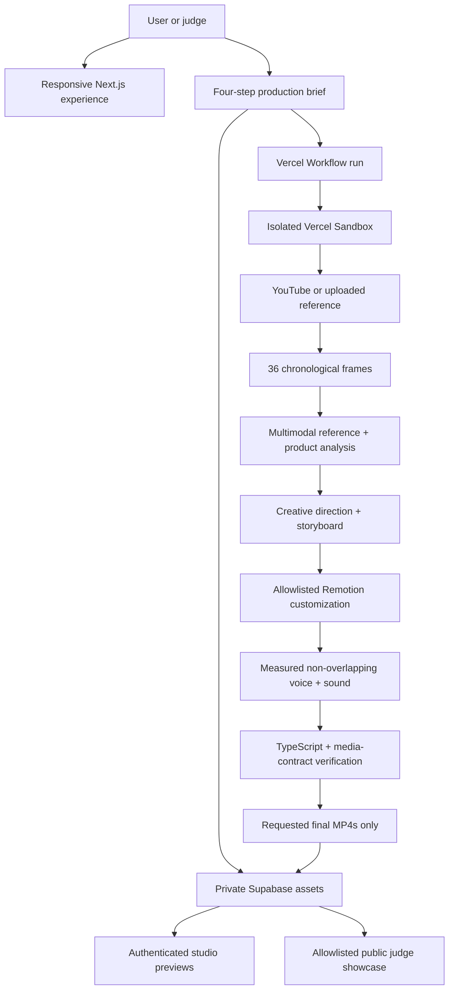

# LaunchLayer Architecture

## System Boundary

LaunchLayer productizes Aariz's existing Promo-Video creative system under `generator/promo-video/`. The generator supplies the Remotion motion vocabulary, scene contract, audio builder, and production principles. The SaaS adds validated inputs, human steering, authentication, durable orchestration, isolated execution, live progress, cost guards, responsive previews, and secure delivery.

The motion reference is strictly style-only. Its ordered frames are analyzed for rhythm, composition, typography, transitions, camera behavior, and beat structure. Reference footage and protected expression never enter the generated film.

## End-to-End Flow

## Durable Agent Loop

The nine workflow stages are `preflight`, `inputs`, `reference`, `application`, `direction`, `storyboard`, `customize`, `audio`, and `delivery`. Each stage persists a human-readable event and streams progress to the project studio. Page refreshes do not cancel production. Retry limits are stage-specific, and paid creative work is reused when a later delivery concern must resume.

This is one orchestrated agent loop with specialized stages, not nine independent chatbots. The UX makes the loop legible so the user can see observations, decisions, code production, media work, and verification as distinct responsibilities.

## Reference Intelligence

`yt-dlp` runs inside the Sandbox with optional cookies or proxy support for cloud YouTube restrictions. A user can upload the reference video if YouTube blocks server access. FFmpeg samples 36 chronological frames, and the bundled watch runtime produces a structured breakdown. The reference remains creative context; output media is built only from the user's assets and generated code.

## Audio Safety

The audio builder requests one consistent `coral` narrator by default. It first generates and trims natural takes, measures their real durations, and then schedules them sequentially. A minimum gap is mandatory; tempo is bounded; a script that cannot fit calmly fails with a request to shorten copy instead of overlapping voices.

The product name is passed separately to the audio runtime. Camel-cased wordmarks are split for speech, so `SafeMama` is narrated as “Safe Mama” while the visual brand remains unchanged. The customization validator rejects any generated audio file that removes these protections before TTS or rendering can run.

## Data and Storage

LaunchLayer reuses Caption AI's Supabase identity system while isolating application state:

- `launchlayer_projects`: indexed, RLS-protected project documents.
- `usage_analytics`: lightweight `launchlayer.project.*` audit events.
- `launchlayer-assets`: private user inputs.
- `launchlayer-renders`: private final MP4 deliverables.

Intermediate frames, generated source, audio cache, production directories, and archives are never uploaded. They exist only inside the temporary Sandbox. The cleanup cron removes expired LaunchLayer media without touching Caption AI records or buckets.

## Public Demo Boundary

Normal project APIs require an authenticated Supabase user and verify ownership. `/demo` is intentionally public for hackathon viability. Its API accepts only two fixed SafeMama output IDs, resolves those IDs against one fixed completed project, verifies `video/mp4`, and redirects to a short-lived signed URL. It cannot enumerate projects, accept storage paths, or read arbitrary outputs.

## Cost and Failure Controls

- A free OpenRouter balance check runs before Sandbox allocation.
- Paid model stages have low retry ceilings.
- Audio and delivery do not repeat completed creative stages.
- Existing production results are recoverable after transport failures.
- CI and browser verification never invoke paid models.
- Model-based visual repair is disabled by default for the hackathon build; deterministic type and media checks remain enabled.

## Trust Boundaries

- `SUPABASE_SERVICE_ROLE_KEY`, `OPENROUTER_API_KEY`, `CRON_SECRET`, `GITHUB_TOKEN`, and optional Vercel credentials remain server-only.
- Signed asset URLs are stripped before model prompts.
- Generated paths are restricted to the theme, font, scene, and audio allowlist.
- The `style-only` policy is both a schema literal and a workflow assertion.
- Sandboxes have bounded resources, hard timeouts, and guaranteed cleanup on success or failure.
